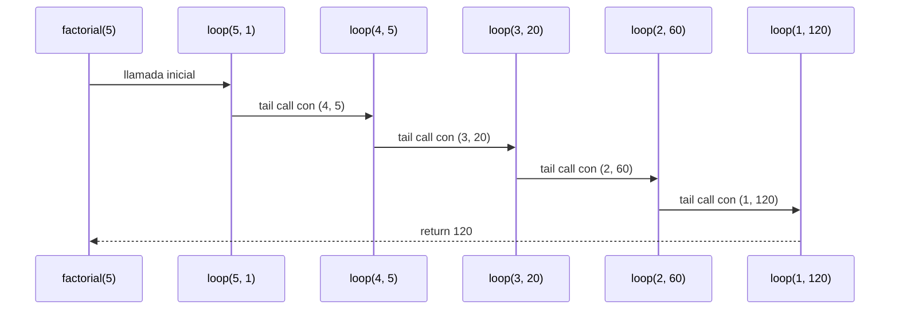
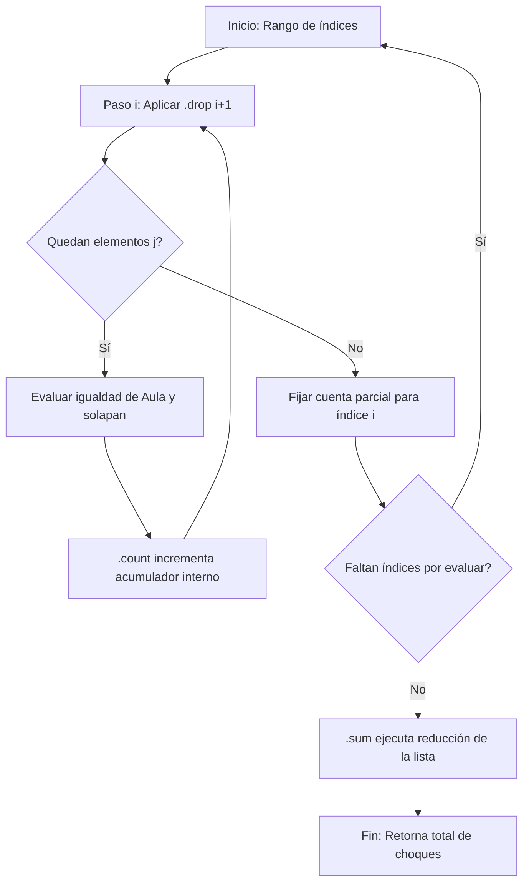

# Informe de proceso Algoritmo Factorial con Recursión de Cola

## Definición del Algoritmo

```Scala
def factorial(n: Int): BigInt = {
  @annotation.tailrec
  def loop(x: Int, acumulador: BigInt): BigInt = {
    if (x <= 1) acumulador
    else loop(x - 1, acumulador * x)
  }
  loop(n, 1)
}
```

- La función `factorial` calcula el factorial de un número `n` utilizando **recursión de cola**.
- La función interna `loop` es la que hace la recursión:
  - Recibe dos parámetros:
    - `x`: el valor actual decreciente hasta llegar a 1.
    - `acumulador`: donde se guarda el resultado parcial en cada paso.

- El decorador `@annotation.tailrec` obliga a que la función sea optimizada como recursión de cola, es decir, **no se acumulan llamados en la pila**.

## Explicación paso a paso

### Caso base

```Scala
if (x <= 1) acumulador
```

Cuando `x` llega a `1`, la función retorna directamente el valor acumulado, evitando más llamadas.

### Caso recursivo

```Scala
loop(x - 1, acumulador * x)
```

En cada llamada:

- Se reduce el valor de `x` en 1.
- Se multiplica el acumulador por `x` y se pasa a la siguiente iteración.
- Como es recursión de cola, la llamada recursiva es la **última instrucción** en ejecutarse, lo que permite a Scala optimizar la pila.

---

## Llamados de pila en recursión de cola

Ejemplo:

```Scala
factorial(5)
```

### Paso 1: Llamada inicial

```Scala
loop(5, 1)
```

### Paso 2: Primera iteración

```Scala
loop(4, 5)   // acumulador = 1 * 5
```

### Paso 3: Segunda iteración

```Scala
loop(3, 20)  // acumulador = 5 * 4
```

### Paso 4: Tercera iteración

```Scala
loop(2, 60)  // acumulador = 20 * 3
```

### Paso 5: Cuarta iteración

```Scala
loop(1, 120) // acumulador = 60 * 2
```

### Paso 6: Caso base

```Scala
return 120
```

---

## Diferencia con recursión normal

- En **recursión normal** cada llamada queda en la pila esperando a que termine la siguiente, lo que puede causar desbordamiento si `n` es muy grande.
- En **recursión de cola**, el compilador transforma el proceso en un **bucle optimizado**, por lo que no se guarda cada llamada en la pila y el algoritmo puede ejecutarse para valores muy grandes sin problema.

---

## Ejemplo de uso

```Scala
val resultado = factorial(5)
println(resultado)  // 120
```

El resultado de `factorial(5)` es `120`.

## Diagrama de llamados de pila con recursión de cola


---
# Informe de proceso 

## Puntos 2.3, 2.4 y 2.5

## Definición del Algoritmo

```scala
/**
   * Número de pares (i, j) con i < j tales que a(i) == a(j) >= 0
   * y los cursos i y j se solapan.
   */
  def choques(cursos: Cursos, a: Asignacion): Int = {
    cursos.indices.map { i =>
      // Para cada curso i contamos los choques con los cursos posteriores
      cursos.indices.drop(i + 1).count { j =>
        // Hay choque si ambos cursos están en la misma aula,
        // el aula es válida y los horarios se traslapan
        a(i) >= 0 &&
          a(i) == a(j) &&
          solapan(cursos(i), cursos(j))
      }
    }.sum // Sumamos todos los choques encontrados
  }
```
- La función `choques` calcula la cantidad de colisiones de horarios en la asignación de aulas utilizando métodos combinadores sobre colecciones inmutables.
- La función interna opera sobre el rango de índices (`cursos.indices`):
  - Recibe de manera implícita dos parámetros de control en cada transformación:
    - El índice actual `i` que recorre el vector de forma lineal de $0$ a $n-1$.
    - Un sub-vector filtrado mediante `.drop(i + 1)` que contiene los elementos pendientes de comparación para evitar redundancias ($i < j$).
- Las funciones de alto orden encapsulan el estado, simulando una optimización donde **no se acumulan llamados en la pila de ejecución**, comportándose como una recursión de cola perezosa.

---

## Explicación paso a paso

### Caso base

```scala
cursos.indices.drop(cursos.length) // Produce un Vector() vacío
```
Cuando el método de alto orden agota los elementos del rango (por ejemplo, al evaluar el último índice $i = n-1$ cuyo `drop(n)` resulta en una colección vacía), el combinador `.count` retorna directamente `0`. Al final de la cadena, el método de reducción `.sum` recibe los valores neutros y detiene el proceso de acumulación sin generar nuevas evaluaciones.

### Caso recursivo / inductivo

```scala
cursos.indices.drop(i + 1).count { j => ... }
```

En cada paso del procesamiento, el motor de Scala reduce el problema de la siguiente manera:
- Decrementa el espacio de búsqueda restante aplicando `.drop(i + 1)` sobre la secuencia de índices posteriores.
- Evalúa la función lambda (predicado lógico) sobre el elemento actual para incrementar el acumulador interno de colisiones si y solo si los cursos comparten la misma aula y sus tiempos se cruzan.

---

## Pasos de la ejecución (Caso de estudio con n=3)

Consideremos una asignación `Vector(0, 0, 1)` donde el curso 0 y el curso 1 están en la misma aula (0) y sus horarios se traslapan (`solapan == true`), y el curso 2 está en otra aula.

### Paso 1: Estado inicial

```scala
// Evaluación para i = 0
cursos.indices.drop(1) // Genera el sub-vector de índices j: Vector(1, 2)
```
Se evalúa la pareja $(c_0, c_1)$. Como pertenecen al aula 0 y se cruzan en tiempo, el predicado es verdadero. La pareja $(c_0, c_2)$ da falso. El acumulador parcial para $i=0$ registra `1`.

### Paso 2: Primera iteración

```scala
// Evaluación para i = 1
cursos.indices.drop(2) // Genera el sub-vector de índices j: Vector(2)
```
Se evalúa la pareja $(c_1, c_2)$. Las aulas son distintas, por lo que el predicado de conteo registra `0`.

### Paso 3: Segunda iteración (Caso Base de la Secuencia)

```scala
// Evaluación para i = 2
cursos.indices.drop(3) // Genera un Vector() vacío
```
Al no existir elementos posteriores, el conteo automático de este paso es `0`.

### Paso 4: Reducción Final

```scala
Vector(1, 0, 0).sum
```
El método `.sum` realiza la operación asociativa final ($1 + 0 + 0$), retornando un total de `1` choque detectado en todo el sistema.

---

## Diferencia con recursión normal

- En **recursión normal**, cada evaluación de colisiones entre pares de cursos dejaría un registro pendiente en la pila de llamadas (*stack frame*), lo que expondría al programa a un error de desbordamiento de pila (`StackOverflowError`) si el volumen de cursos matriculados fuera muy elevado.
- En este enfoque con **funciones de alto orden**, Scala optimiza internamente el recorrido del `Vector` inmutable de manera iterativa y lineal, encapsulando el estado en acumuladores internos. Esto equivale a una **recursión de cola**, permitiendo procesar grandes volúmenes de asignaciones sin riesgo de agotar la memoria.

---

## Ejemplo de uso

```scala
/** Devuelve true sii los intervalos [ini1, fin1) y [ini2, fin2) se traslapan. */
  def solapan(c1: Curso, c2: Curso): Boolean =
    iniCurso(c1) < finCurso(c2) && iniCurso(c2) < finCurso(c1)
```
```scala
/** Cantidad de cursos cuya aula asignada tiene capacidad menor al número de estudiantes. */
  def capacidadFallida(cursos: Cursos, aulas: Aulas, a: Asignacion): Int =
    cursos.indices          // genera los índices 0..n-1
      .count { i =>         // cuenta directamente los que cumplan la condición
        a(i) >= 0 &&        // el curso está asignado a algún aula
          capAula(aulas(a(i))) < estCurso(cursos(i))  // el aula no alcanza para los estudiantes
      }
```

Las funciones accesorias permiten extraer las dimensiones del problema de manera limpia y sin efectos secundarios, manteniendo la inmutabilidad de los datos.

---

## Flujo Secuencial de Datos

A continuación, se detalla el comportamiento del procesamiento modular de las colecciones:


---
