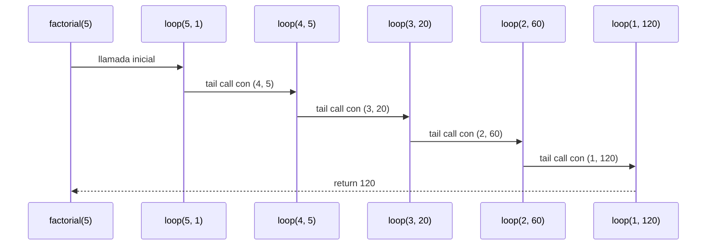
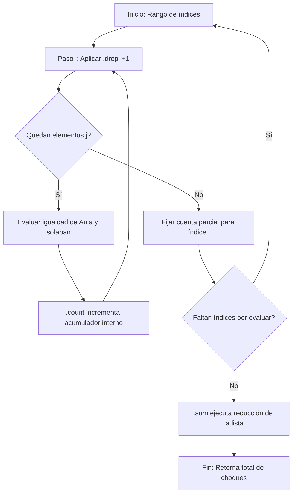
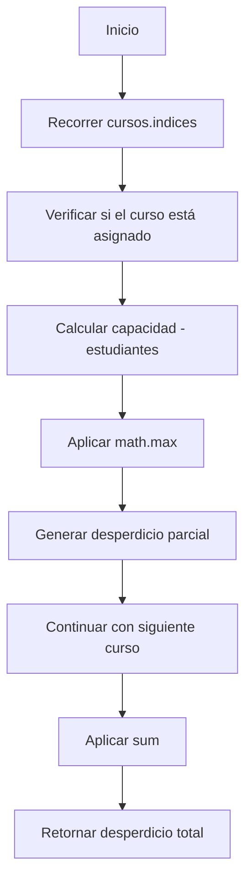
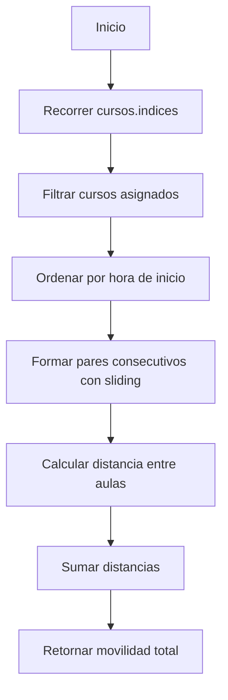
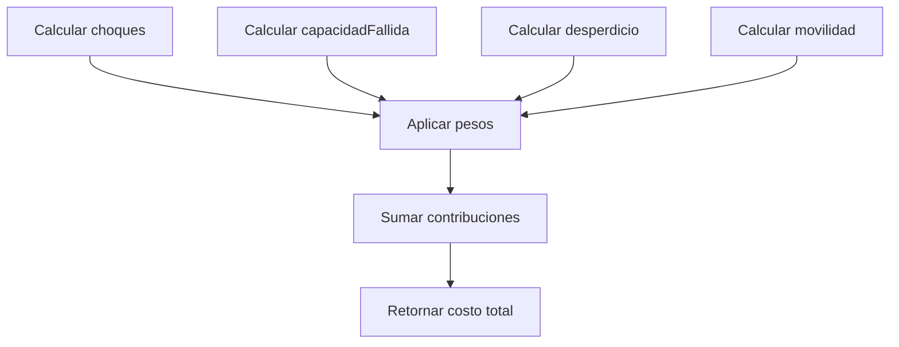

# Informe de proceso Algoritmo Factorial con Recursión de Cola

## Definición del Algoritmo

```Scala
def factorial(n: Int): BigInt = {
  @annotation.tailrec
  def loop(x: Int, acumulador: BigInt): BigInt = {
    if (x <= 1) acumulador
    else loop(x - 1, acumulador * x)
  }
  loop(n, 1)
}
```

- La función `factorial` calcula el factorial de un número `n` utilizando **recursión de cola**.
- La función interna `loop` es la que hace la recursión:
  - Recibe dos parámetros:
    - `x`: el valor actual decreciente hasta llegar a 1.
    - `acumulador`: donde se guarda el resultado parcial en cada paso.

- El decorador `@annotation.tailrec` obliga a que la función sea optimizada como recursión de cola, es decir, **no se acumulan llamados en la pila**.

## Explicación paso a paso

### Caso base

```Scala
if (x <= 1) acumulador
```

Cuando `x` llega a `1`, la función retorna directamente el valor acumulado, evitando más llamadas.

### Caso recursivo

```Scala
loop(x - 1, acumulador * x)
```

En cada llamada:

- Se reduce el valor de `x` en 1.
- Se multiplica el acumulador por `x` y se pasa a la siguiente iteración.
- Como es recursión de cola, la llamada recursiva es la **última instrucción** en ejecutarse, lo que permite a Scala optimizar la pila.

---

## Llamados de pila en recursión de cola

Ejemplo:

```Scala
factorial(5)
```

### Paso 1: Llamada inicial

```Scala
loop(5, 1)
```

### Paso 2: Primera iteración

```Scala
loop(4, 5)   // acumulador = 1 * 5
```

### Paso 3: Segunda iteración

```Scala
loop(3, 20)  // acumulador = 5 * 4
```

### Paso 4: Tercera iteración

```Scala
loop(2, 60)  // acumulador = 20 * 3
```

### Paso 5: Cuarta iteración

```Scala
loop(1, 120) // acumulador = 60 * 2
```

### Paso 6: Caso base

```Scala
return 120
```

---

## Diferencia con recursión normal

- En **recursión normal** cada llamada queda en la pila esperando a que termine la siguiente, lo que puede causar desbordamiento si `n` es muy grande.
- En **recursión de cola**, el compilador transforma el proceso en un **bucle optimizado**, por lo que no se guarda cada llamada en la pila y el algoritmo puede ejecutarse para valores muy grandes sin problema.

---

## Ejemplo de uso

```Scala
val resultado = factorial(5)
println(resultado)  // 120
```

El resultado de `factorial(5)` es `120`.

## Diagrama de llamados de pila con recursión de cola


---
# Informe de proceso 

## Puntos 2.3, 2.4 y 2.5

## Definición del Algoritmo

```scala
/**
   * Número de pares (i, j) con i < j tales que a(i) == a(j) >= 0
   * y los cursos i y j se solapan.
   */
  def choques(cursos: Cursos, a: Asignacion): Int = {
    cursos.indices.map { i =>
      // Para cada curso i contamos los choques con los cursos posteriores
      cursos.indices.drop(i + 1).count { j =>
        // Hay choque si ambos cursos están en la misma aula,
        // el aula es válida y los horarios se traslapan
        a(i) >= 0 &&
          a(i) == a(j) &&
          solapan(cursos(i), cursos(j))
      }
    }.sum // Sumamos todos los choques encontrados
  }
```
- La función `choques` calcula la cantidad de colisiones de horarios en la asignación de aulas utilizando métodos combinadores sobre colecciones inmutables.
- La función interna opera sobre el rango de índices (`cursos.indices`):
  - Recibe de manera implícita dos parámetros de control en cada transformación:
    - El índice actual `i` que recorre el vector de forma lineal de $0$ a $n-1$.
    - Un sub-vector filtrado mediante `.drop(i + 1)` que contiene los elementos pendientes de comparación para evitar redundancias ($i < j$).
- Las funciones de alto orden encapsulan el estado, simulando una optimización donde **no se acumulan llamados en la pila de ejecución**, comportándose como una recursión de cola perezosa.

---

## Explicación paso a paso

### Caso base

```scala
cursos.indices.drop(cursos.length) // Produce un Vector() vacío
```
Cuando el método de alto orden agota los elementos del rango (por ejemplo, al evaluar el último índice $i = n-1$ cuyo `drop(n)` resulta en una colección vacía), el combinador `.count` retorna directamente `0`. Al final de la cadena, el método de reducción `.sum` recibe los valores neutros y detiene el proceso de acumulación sin generar nuevas evaluaciones.

### Caso recursivo / inductivo

```scala
cursos.indices.drop(i + 1).count { j => ... }
```

En cada paso del procesamiento, el motor de Scala reduce el problema de la siguiente manera:
- Decrementa el espacio de búsqueda restante aplicando `.drop(i + 1)` sobre la secuencia de índices posteriores.
- Evalúa la función lambda (predicado lógico) sobre el elemento actual para incrementar el acumulador interno de colisiones si y solo si los cursos comparten la misma aula y sus tiempos se cruzan.

---

## Pasos de la ejecución (Caso de estudio con n=3)

Consideremos una asignación `Vector(0, 0, 1)` donde el curso 0 y el curso 1 están en la misma aula (0) y sus horarios se traslapan (`solapan == true`), y el curso 2 está en otra aula.

### Paso 1: Estado inicial

```scala
// Evaluación para i = 0
cursos.indices.drop(1) // Genera el sub-vector de índices j: Vector(1, 2)
```
Se evalúa la pareja $(c_0, c_1)$. Como pertenecen al aula 0 y se cruzan en tiempo, el predicado es verdadero. La pareja $(c_0, c_2)$ da falso. El acumulador parcial para $i=0$ registra `1`.

### Paso 2: Primera iteración

```scala
// Evaluación para i = 1
cursos.indices.drop(2) // Genera el sub-vector de índices j: Vector(2)
```
Se evalúa la pareja $(c_1, c_2)$. Las aulas son distintas, por lo que el predicado de conteo registra `0`.

### Paso 3: Segunda iteración (Caso Base de la Secuencia)

```scala
// Evaluación para i = 2
cursos.indices.drop(3) // Genera un Vector() vacío
```
Al no existir elementos posteriores, el conteo automático de este paso es `0`.

### Paso 4: Reducción Final

```scala
Vector(1, 0, 0).sum
```
El método `.sum` realiza la operación asociativa final ($1 + 0 + 0$), retornando un total de `1` choque detectado en todo el sistema.

---

## Diferencia con recursión normal

- En **recursión normal**, cada evaluación de colisiones entre pares de cursos dejaría un registro pendiente en la pila de llamadas (*stack frame*), lo que expondría al programa a un error de desbordamiento de pila (`StackOverflowError`) si el volumen de cursos matriculados fuera muy elevado.
- En este enfoque con **funciones de alto orden**, Scala optimiza internamente el recorrido del `Vector` inmutable de manera iterativa y lineal, encapsulando el estado en acumuladores internos. Esto equivale a una **recursión de cola**, permitiendo procesar grandes volúmenes de asignaciones sin riesgo de agotar la memoria.

---

## Ejemplo de uso

```scala
/** Devuelve true sii los intervalos [ini1, fin1) y [ini2, fin2) se traslapan. */
  def solapan(c1: Curso, c2: Curso): Boolean =
    iniCurso(c1) < finCurso(c2) && iniCurso(c2) < finCurso(c1)
```
```scala
/** Cantidad de cursos cuya aula asignada tiene capacidad menor al número de estudiantes. */
  def capacidadFallida(cursos: Cursos, aulas: Aulas, a: Asignacion): Int =
    cursos.indices          // genera los índices 0..n-1
      .count { i =>         // cuenta directamente los que cumplan la condición
        a(i) >= 0 &&        // el curso está asignado a algún aula
          capAula(aulas(a(i))) < estCurso(cursos(i))  // el aula no alcanza para los estudiantes
      }
```

Las funciones accesorias permiten extraer las dimensiones del problema de manera limpia y sin efectos secundarios, manteniendo la inmutabilidad de los datos.

---

## Flujo Secuencial de Datos

A continuación, se detalla el comportamiento del procesamiento modular de las colecciones:


---
## Punto 2.5 - Calculando fallos y desperdicio de capacidad

### Definición del Algoritmo

```scala
def desperdicio(cursos: Cursos, aulas: Aulas, a: Asignacion): Int =
  cursos.indices.map { i =>
    if (a(i) >= 0) {
      val dif = capAula(aulas(a(i))) - estCurso(cursos(i))
      math.max(dif, 0)
    } else 0
  }.sum
```

* La función `desperdicio` calcula la capacidad total desaprovechada en las aulas asignadas.
* Para cada curso asignado se calcula la diferencia entre la capacidad del aula y la cantidad de estudiantes matriculados.
* Si la diferencia es negativa, se toma el valor $0$ para evitar contabilizar desperdicios inexistentes.
* Finalmente, se suman todos los desperdicios parciales mediante la función de alto orden `sum`.

### Explicación paso a paso

#### Caso base

```scala
if (a(i) < 0) 0
```

Cuando un curso no tiene aula asignada, no aporta desperdicio al resultado final.

Además, si la diferencia entre capacidad y estudiantes es negativa:

```scala
math.max(dif, 0)
```

retorna $0$, evitando contabilizar valores inválidos.

#### Caso inductivo

```scala
val dif = capAula(aulas(a(i))) - estCurso(cursos(i))
```

Para cada curso:

* Se obtiene la capacidad del aula asignada.
* Se obtiene el número de estudiantes del curso.
* Se calcula la diferencia entre ambos valores.
* Se conserva únicamente la parte positiva mediante `math.max`.
* El resultado se incorpora al cálculo total utilizando `.sum`.

---

### Pasos de la ejecución

Supongamos:

```scala
a = Vector(0, 1, 0)
```

con:

| Curso | Capacidad Aula | Estudiantes |
| ----- | -------------- | ----------- |
| C1    | 30             | 25          |
| C2    | 40             | 30          |
| C3    | 30             | 20          |

#### Paso 1

```scala
30 - 25 = 5
```

Desperdicio acumulado:

```scala
5
```

#### Paso 2

```scala
40 - 30 = 10
```

Desperdicio acumulado:

```scala
5 + 10 = 15
```

#### Paso 3

```scala
30 - 20 = 10
```

Desperdicio acumulado:

```scala
15 + 10 = 25
```

#### Resultado final

```scala
Vector(5,10,10).sum
```

$$
5 + 10 + 10 = 25
$$

La función retorna:

```scala
25
```

---

### Diferencia con recursión normal

* En una implementación recursiva tradicional se recorrería la colección realizando una llamada por cada curso.
* En esta solución funcional el recorrido es realizado internamente por `map`.
* La acumulación final se realiza mediante `sum`, evitando variables mutables y manteniendo un estilo funcional.

---

### Ejemplo de uso

```scala
val resultado = desperdicio(cursos, aulas, asignacion)
println(resultado)
```

Si la capacidad sobrante total es 25 puestos, la función retorna:

```scala
25
```

### Flujo Secuencial de Datos



---

## Punto 2.6 - Calculando el costo de movilidad

### Definición del Algoritmo

```scala
def movilidad(cursos: Cursos, aulas: Aulas, d: Distancias,
              a: Asignacion): Int =
  cursos.indices
    .filter(i => a(i) >= 0)
    .sortBy(i => iniCurso(cursos(i)))
    .sliding(2)
    .map { par =>
      d(a(par(0)))(a(par(1)))
    }.sum
```

* La función `movilidad` calcula la distancia total recorrida entre aulas de cursos consecutivos.
* Inicialmente se seleccionan únicamente los cursos que tienen un aula asignada mediante `filter`.
* Posteriormente los cursos se ordenan por hora de inicio utilizando `sortBy`.
* La función `sliding(2)` construye pares de cursos consecutivos.
* Para cada par se obtiene la distancia entre las aulas asignadas.
* Finalmente, todas las distancias calculadas se suman utilizando `sum`.

### Explicación paso a paso

#### Caso base

```scala
.filter(i => a(i) >= 0)
```

Si no existen cursos asignados o únicamente existe un curso asignado, no habrá pares consecutivos que procesar.

En ese caso la movilidad total es:

$$
MV = 0
$$

#### Caso inductivo

```scala
.sliding(2)
.map { par =>
  d(a(par(0)))(a(par(1)))
}
```

Para cada par consecutivo de cursos:

* Se obtiene el aula del primer curso.
* Se obtiene el aula del segundo curso.
* Se consulta la distancia entre ambas aulas en la matriz de distancias.
* La distancia calculada se agrega al conjunto de resultados parciales.
* Finalmente todas las distancias se suman mediante `.sum`.

---

### Pasos de la ejecución

Supongamos la siguiente asignación:

```scala
a = Vector(0, 1, 0)
```

y los cursos:

| Curso | Hora Inicio | Aula |
| ----- | ----------- | ---- |
| M01   | 4           | 0    |
| M02   | 6           | 1    |
| M03   | 12          | 0    |

Matriz de distancias:

$$
D =
\begin{bmatrix}
0 & 3\
3 & 0
\end{bmatrix}
$$

#### Paso 1

```scala
cursos.indices
```

Genera:

```scala
Vector(0,1,2)
```

#### Paso 2

```scala
.filter(i => a(i) >= 0)
```

Todos los cursos están asignados:

```scala
Vector(0,1,2)
```

#### Paso 3

```scala
.sortBy(i => iniCurso(cursos(i)))
```

Los cursos ya se encuentran ordenados por hora de inicio:

```scala
Vector(0,1,2)
```

#### Paso 4

```scala
.sliding(2)
```

Genera los pares consecutivos:

```scala
Vector(0,1)
Vector(1,2)
```

#### Paso 5

Se calculan las distancias:

Primer par:

```scala
d(0)(1) = 3
```

Segundo par:

```scala
d(1)(0) = 3
```

#### Paso 6

```scala
Vector(3,3).sum
```

$$
3 + 3 = 6
$$

La movilidad total es:

```scala
6
```

---

### Diferencia con recursión normal

* En una implementación recursiva tradicional se recorrerían manualmente los cursos ordenados calculando la distancia entre cada par consecutivo.
* En esta solución funcional, el recorrido es realizado mediante funciones de alto orden.
* `filter` selecciona los cursos válidos.
* `sortBy` organiza los cursos cronológicamente.
* `sliding` construye automáticamente los pares consecutivos.
* `map` transforma cada par en una distancia.
* `sum` realiza la acumulación final.

---

### Ejemplo de uso

```scala
val resultado = movilidad(cursos, aulas, distancias, asignacion)
println(resultado)
```

Si la distancia total recorrida entre aulas consecutivas es 6, la función retorna:

```scala
6
```

### Flujo Secuencial de Datos


---
## Punto 2.7 - Calculando el costo total

### Definición del Algoritmo

```scala
def costoAsignacion(cursos: Cursos, aulas: Aulas, d: Distancias,
                    a: Asignacion, w: Pesos): Int = {

  // Guardamos cada peso en una variable para usar la fórmula más fácilmente
  val (wCH, wCF, wDE, wMV) = w

  wCH * choques(cursos, a) +
  wCF * capacidadFallida(cursos, aulas, a) +
  wDE * desperdicio(cursos, aulas, a) +
  wMV * movilidad(cursos, aulas, d, a)
}
```

* La función `costoAsignacion` calcula el costo total de una asignación de aulas.
* Inicialmente se extraen los pesos asociados a cada criterio de evaluación mediante pattern matching.
* Posteriormente se calculan las métricas:

  * Choques de horario.
  * Fallos de capacidad.
  * Desperdicio de capacidad.
  * Costo de movilidad.
* Cada métrica es multiplicada por su peso correspondiente.
* Finalmente se suman todas las contribuciones para obtener el costo total.

### Explicación paso a paso

#### Caso base

No existe un caso base explícito, ya que la función no realiza recorridos ni llamadas recursivas.

El cálculo depende de los valores retornados por:

```scala
choques(...)
capacidadFallida(...)
desperdicio(...)
movilidad(...)
```

Si todas las métricas son iguales a cero, el costo total será:

$$
CT = 0
$$

#### Caso inductivo

```scala
wCH \cdot CH +
wCF \cdot CF +
wDE \cdot DE +
wMV \cdot MV
```

La función aplica directamente la fórmula definida en el enunciado del proyecto:

$$
CT =
w_{CH} \cdot CH +
w_{CF} \cdot CF +
w_{DE} \cdot DE +
w_{MV} \cdot MV
$$

donde:

* $CH$ representa los choques de horario.
* $CF$ representa los fallos de capacidad.
* $DE$ representa el desperdicio de capacidad.
* $MV$ representa el costo de movilidad.

---

### Pasos de la ejecución

Supongamos:

```scala
w = (1000, 100, 1, 2)
```

y los siguientes resultados obtenidos previamente:

```scala
CH = 0
CF = 1
DE = 25
MV = 6
```

#### Paso 1

Aplicar el peso de choques:

$$
1000 \cdot 0 = 0
$$

#### Paso 2

Aplicar el peso de capacidad fallida:

$$
100 \cdot 1 = 100
$$

#### Paso 3

Aplicar el peso del desperdicio:

$$
1 \cdot 25 = 25
$$

#### Paso 4

Aplicar el peso de movilidad:

$$
2 \cdot 6 = 12
$$

#### Paso 5

Sumar todas las contribuciones:

$$
0 + 100 + 25 + 12 = 137
$$

La función retorna:

```scala
137
```

---

### Diferencia con recursión normal

* En una implementación recursiva tradicional podrían calcularse las métricas recorriendo manualmente las colecciones involucradas.
* En esta solución funcional cada métrica ya fue calculada previamente mediante funciones especializadas.
* La función `costoAsignacion` únicamente integra los resultados aplicando la fórmula matemática del costo total.
* El enfoque favorece la modularidad y reutilización del código.

---

### Ejemplo de uso

```scala
val resultado =
  costoAsignacion(cursos, aulas, distancias, asignacion, pesos)

println(resultado)
```

Si el costo calculado es 137, la función retorna:

```scala
137
```

### Flujo Secuencial de Datos



---

## Conclusión de los puntos 2.5, 2.6 y 2.7

Las funciones `desperdicio`, `movilidad` y `costoAsignacion` permiten evaluar la calidad de una asignación de aulas desde diferentes perspectivas.
La primera cuantifica la capacidad desaprovechada, la segunda mide la distancia recorrida entre aulas consecutivas y la tercera integra todas las métricas relevantes mediante una función de costo ponderada.
En conjunto, estas funciones constituyen la base para comparar distintas asignaciones y seleccionar posteriormente aquella que minimice el costo total.

---